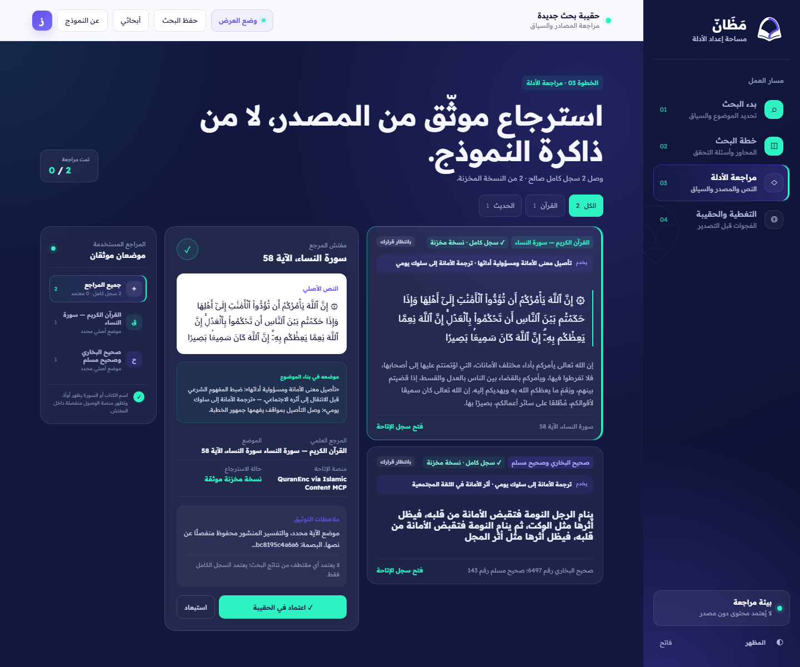
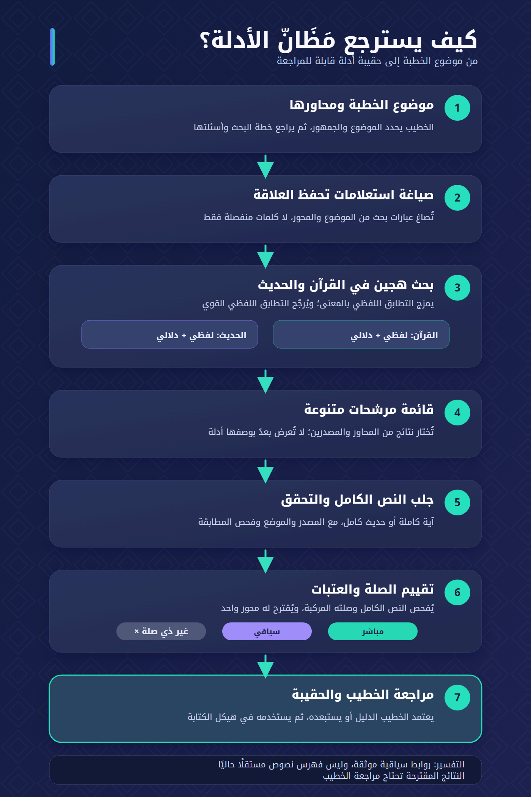

# مَظَانّ

**مساعد بحث مسؤول لخطيب الجمعة يحوّل الموضوع إلى خطة بحث مفسّرة وحقيبة أدلة كاملة قابلة للمراجعة، مع بقاء اعتماد الخطة والأدلة والقرار النهائي بيد الخطيب أو المختص.**

[تجربة مَظَانّ مباشرة](https://mazann.51.254.141.28.sslip.io/) · [فيديو العرض — 1:52](https://youtu.be/dUlSn54A9T0) · [خريطة معايير التحكيم](docs/JUDGING_CRITERIA_MAP_AR.md) · [دليل المحكّم](docs/JUDGE_GUIDE_AR.md)

> [شاهد العرض التوضيحي النهائي على YouTube](https://youtu.be/dUlSn54A9T0) — يشرح المشكلة والحل ورحلة المنتج خلال أقل من دقيقتين.



## تجربة سريعة للمحكّم

يمكن اختبار الرحلة الأساسية خلال ثلاث دقائق:

1. افتح [الرابط المباشر](https://mazann.51.254.141.28.sslip.io/) وأدخل موضوعًا مثل `أثر حسن الخلق على الفرد والمجتمع` مع الجمهور والمدة.
2. راجع المحاور المقترحة، وافتح «لماذا هذا المحور؟»، وعدّل الخطة أو اعتمدها.
3. افتح دليلًا كاملًا، ثم انتقل إلى مصدره الأصلي، وغيّر موضع استخدامه، واعتمده أو استبعده.
4. راجع هيكل الكتابة المرتبط بالأدلة، ثم احفظ البحث أو صدّره.

إذا تعذر مصدر خارجي، يعلن النظام الانتقال إلى نسخة موثقة أو يمتنع عن عرض دليل. لا يستخدم ذاكرة النموذج أو بحث الويب المفتوح بديلًا صامتًا.

## المشكلة والحل

يتنقل الخطيب أثناء إعداد المادة بين مصادر ونتائج كثيرة، ثم يعيد يدويًا ربط كل نص بموضعه ووظيفته داخل الموضوع. لا تفترض مَظَانّ أن الخطيب يفتقر إلى المصادر أو الخبرة؛ تعالج فجوة التتبع والتنظيم والمراجعة بين الموضوع والدليل والمصدر.

تنفذ نسخة التحدي رحلة واحدة كاملة: موضوع خطبة عربية ← خطة بحث قابلة للتعديل ← استرجاع مرشحات من مصادر معتمدة ← جلب السجل الكامل والتحقق منه ← قرار بشري لكل دليل ← هيكل كتابة مرتبط بالمراجع والفجوات. لا تولد النسخة خطبة نهائية ولا فتوى شخصية.

## ما يميز مَظَانّ

| الممارسة الشائعة | ما تضيفه مَظَانّ |
|---|---|
| نتيجة بحث أو مقتطف غير كافٍ للتحقق | لا يتحول المرشح إلى دليل قبل جلب السجل الكامل والتحقق منه |
| نص مولد يخفي حدود المصدر | فصل النص الأصلي عن الشرح والتنظيم المولد |
| قائمة مراجع بلا وظيفة داخل الموضوع | ربط كل دليل بمحور قابل لتغيير موضعه أو رفضه |
| اكتمال ظاهري رغم نقص المادة | إظهار الفجوة أو تعذر المصدر بدل الإكمال من ذاكرة النموذج |
| قبول آلي غير قابل للتتبع | قرار الخطيب محفوظ مع المصدر والموضع والبصمة |

## البصمة التقنية

- **القرآن:** بحث لفظي BM25 وبحث دلالي على 6236 آية كاملة، ثم دمج رتب RRF محافظ على المطابقة اللفظية. نص الآية والشرح المنشور حقلا بحث منفصلان.
- **الحديث:** بحث حي في HadeethEnc عبر موصل Islamic Content MCP، مع فهرس دلالي محلي محدود النطاق. عُدّ 3574 معرفًا عربيًا فريدًا؛ اجتاز 3553 سجلًا فحوص الاكتمال، وفُهرس 3552 سجلًا دلاليًا. هذه تغطية HadeethEnc العربية المتاحة وليست فهرسًا لكل كتب السنة.
- **الجلب الكامل:** الفهارس تعيد معرفات ومرشحات فقط. يعيد الخادم جلب السجل الرسمي الكامل قبل عرضه، ويحجب المرشح إذا تغيرت بصمة متنه عن نسخة الفهرسة.
- **فحص الصلة:** يقيّم السجل الكامل مقابل الموضوع والمحور، ويميز بين الصلة المباشرة والسياق أو التأصيل. الدرجة اقتراح لترتيب المراجعة وليست حكمًا على صحة الحديث أو كفاية الاستدلال.
- **ضوابط حتمية:** تحفظ وحدات الآيات والأحاديث، وتتحقق من الهوية والموضع والحكم والعزو، وتمنع النشر عند نقص حقل جوهري.
- **تخطيط قابل للمراجعة:** يقترح النموذج محاور منظمة عبر Structured Outputs. أي فشل أو مخرج غير صالح يعيد fallback منهجيًا ظاهرًا.
- **قابلية إعادة الإنتاج:** سجلات مصدر وإصدارات وبصمات SHA-256، وفهرس مشتق قابل لإعادة البناء، ونسخة cache ثابتة لاختبار التحكيم.
- **تشغيل محكوم:** حاوية واحدة غير root، نظام ملفات للقراءة فقط، Linux capabilities معطلة، health check، وفصل بيانات runtime عن الصورة.



## حدود الإصدار الحالي

- يحتاج الحكم على ملاءمة الأدلة الشرعية إلى مراجع مختص؛ الاختبارات الآلية لا تحل محله.
- عتبات الصلة الحالية تشغيلية أولية وليست احتمالات معايرة ولا قياسًا للدقة الشرعية.
- يقتصر الفهرس الحديثي الدلالي على سجلات HadeethEnc العربية التي أمكن عدها والتحقق آليًا من اكتمال حقولها.
- روابط التفسير الحالية قراءة سياقية لأربعة نطاقات آيات؛ لا يدعي المشروع امتلاك فهرس تفسير مستقل.
- التخزين الحالي لمساحة متصفح واحدة وليس نظام حسابات أو صلاحيات مؤسسية.
- إعادة بناء الفهارس الدلالية وتشغيل المخطط وفاحص الصلة تتطلب مفتاح OpenAI خاصًا بالمشغل. يعمل المسار المنهجي والبحث المتاح مع تحذير واضح عند غياب المفتاح.

## بنية المستودع

المشروع modular monolith داخل npm workspaces monorepo:

```text
apps/
  api/                         HTTP API + static host + orchestration
  web/                         Arabic RTL product interface
packages/
  domain/                      canonical evidence normalization
  connectors/islamic-content/ official MCP connector
  contracts/                   schemas, methodology and instructions
data/
  cache/                       immutable judging seed cache
  runtime/                     writable runtime cache, ignored by Git
evaluation/                    protocols, cases, results and evidence
scripts/                       indexes, manifests and evaluation tools
test/                          deterministic product and safety tests
```

اختير نشر حاوية واحدة خلال التحدي لتقليل التعقيد التشغيلي، مع إبقاء حدود الحزم واضحة لإمكان فصلها لاحقًا.

## التشغيل المحلي

المتطلب: Node.js 22 أو أحدث.

```bash
npm ci --ignore-scripts
npm start
```

ثم افتح `http://127.0.0.1:8090`.

يعمل موصل المحتوى الإسلامي بلا مفتاح. الوضع المحلي الافتراضي للمخطط منهجي وحتمي. لتفعيل التخطيط الدلالي وفاحص الصلة، انسخ `.env.example` إلى `.env` وضع مفتاحك الخاص في `OPENAI_API_KEY` وحدد `OPENAI_MODEL`. لا تضف `.env` إلى Git، ولا يحتاج المحكّم إلى مشاركة مفتاح لاستخدام الرابط العام.

تفاصيل المتغيرات والأوضاع في [إعداد المخطط](docs/PLANNER_CONFIGURATION.md).

## التشغيل بالحاوية

```bash
docker compose up --build
```

للإيقاف:

```bash
docker compose down
```

تعليمات النشر العام والتراجع في [دليل النشر](deploy/README.md)، وتشغيل الخدمة ومراقبتها في [دليل العمليات](docs/OPERATIONS.md).

## التحقق والنتائج

```bash
npm test
npm run eval:planner
npm run manifest:sources
npm run eval:quran:hybrid
```

- اجتاز الالتزام `9e642ad` عدد **103/103** اختبارات آلية محليًا وفي GitHub Actions.
- فحص الضغط شمل 15 عنوانًا و332 سجلًا كاملًا. تعرض [صفحة النتائج النهائية](evaluation/FINAL_RESULTS_2026-10-06.md) ما يقيسه الاختبار وما لا يقيسه.
- يولد `manifest:sources` سجلًا حتميًا من معرفات المصادر وبصماتها، وتتحقق CI من عدم وجود فرق غير مسجل.

## نقاط API

- `GET /api/health`
- `GET /api/projects`
- `GET /api/projects/:id`
- `POST /api/projects`
- `POST /api/research/roadmap`
- `POST /api/research/evidence`
- `POST /api/evidence/search`
- `POST /api/evidence/quran`
- `POST /api/evidence/hadith`
- `POST /api/evidence/fetch`

## التوثيق

- [دليل المحكّم المصور](docs/JUDGE_GUIDE_AR.md)
- [خريطة معايير التحكيم والأدلة](docs/JUDGING_CRITERIA_MAP_AR.md)
- [معمارية الحل](SOLUTION_ARCHITECTURE.md)
- [آلية الاسترجاع الواعي بالعلاقة](docs/RELATIONSHIP_AWARE_RETRIEVAL.md)
- [سياسة قاعدة المعرفة](KNOWLEDGE_BASE_POLICY.md)
- [سجل المصادر المعتمدة](KNOWLEDGE_SOURCE_REGISTRY.md)
- [المنهج ومحرك التعليمات](METHODOLOGY_AND_INSTRUCTION_ENGINE.md)
- [مواصفات تجربة المستخدم](UX_SPEC.md)
- [الهوية البصرية وقصة الشعار](GRAPHIC_CHARTER.md)
- [حزمة التقييم](evaluation/README.md)
- [النتائج النهائية وحدودها](evaluation/FINAL_RESULTS_2026-10-06.md)
- [إشعارات المصادر والمكونات](THIRD_PARTY_NOTICES.md)

## سجل المنافسة والشفافية

بدأ التنفيذ الوظيفي يوم 4 أكتوبر 2026. ما سبق ذلك كان بحثًا في المشكلة والمصادر وهوية بصرية ونموذج واجهة ثابتًا بلا backend أو استرجاع أو حفظ أو نشر عامل.

- آخر نقطة قبل المنافسة: `c88c8eb` مع الوسم `pre-competition-baseline-2026-10-04`.
- بداية تنفيذ أيام المنافسة: `792944e`.
- التفاصيل اليومية في [سجل المنافسة](COMPETITION_LOG.md) و[خط الأساس](PRECOMPETITION_BASELINE_2026-10-04.md).

لا تعاد كتابة تواريخ Git، ولا ينقل إلى العرض ادعاء لا يمكن ربطه بكود أو اختبار أو لقطة أو نتيجة مراجعة.

## الترخيص

شفرة مَظَانّ الأصلية متاحة وفق [MIT License](LICENSE). لا يمنح هذا الترخيص أي حق إضافي في نصوص القرآن والحديث، والترجمات، والشروح، والخطوط، والعلامات، أو بيانات وخدمات الجهات الخارجية. راجع [إشعارات المصادر والمكونات](THIRD_PARTY_NOTICES.md) وشروط كل ناشر قبل إعادة الاستخدام أو التوزيع.
