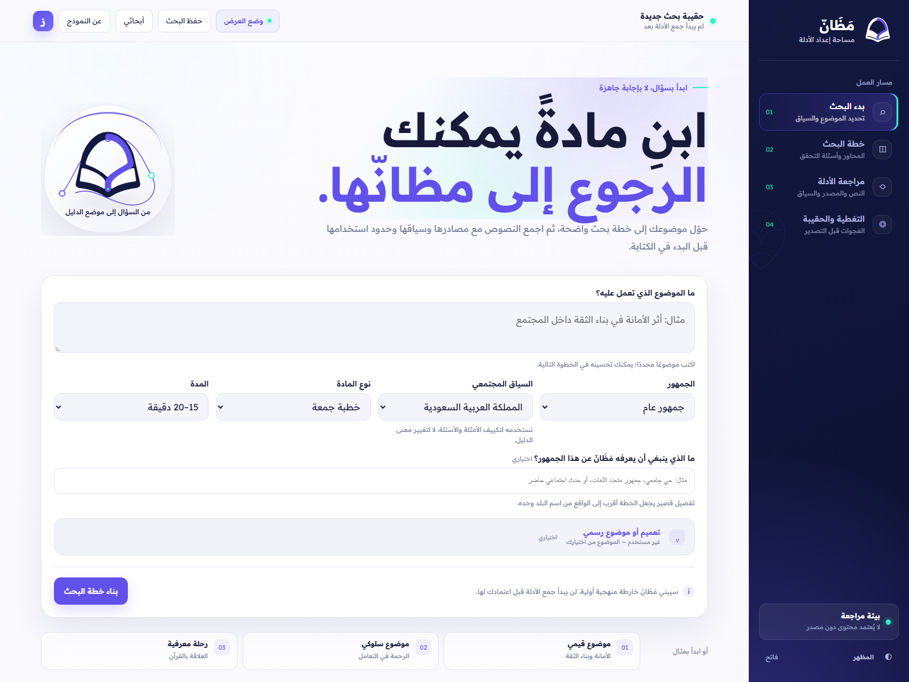
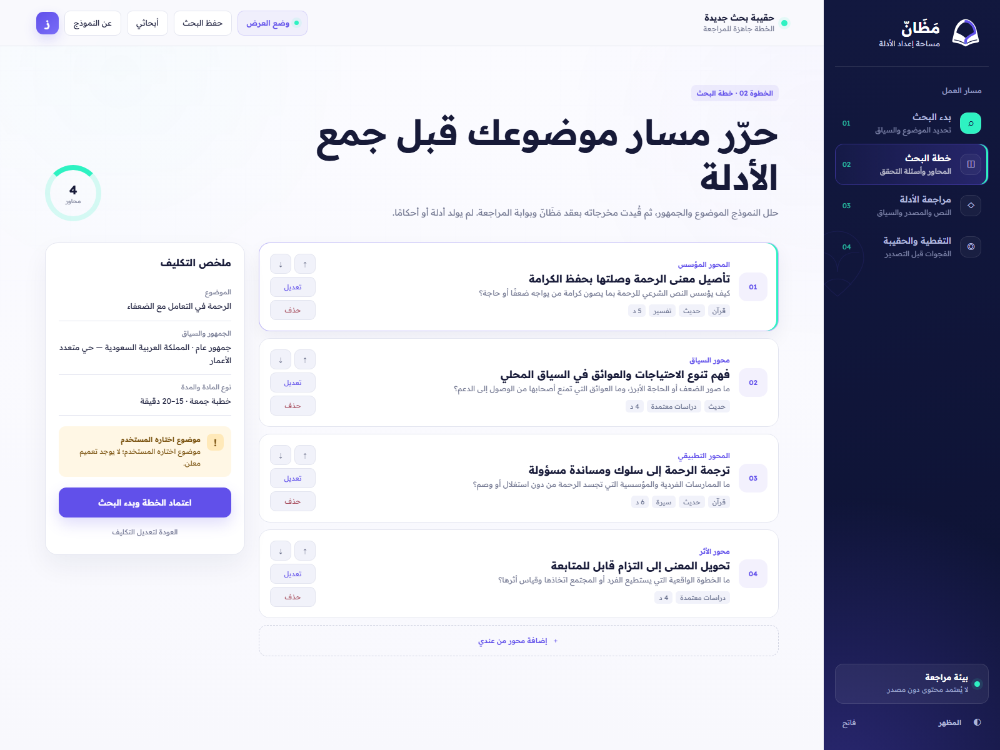
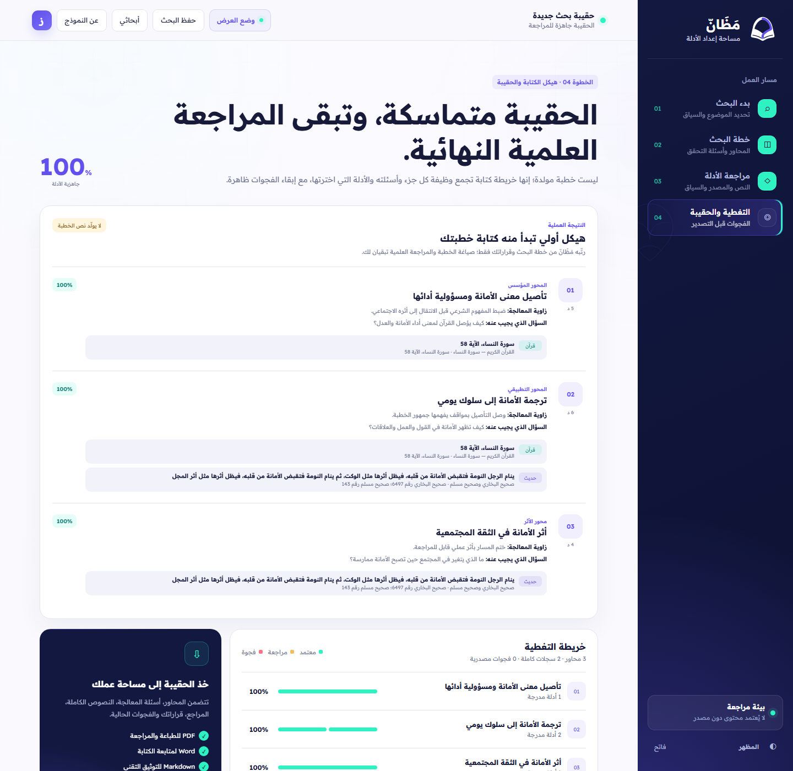

# دليل المحكّم — مَظَانّ

الغرض من هذا الدليل هو إعادة اختبار الوظيفة الأساسية بسرعة، مع توضيح موضع الذكاء الاصطناعي والضوابط الحتمية وحدود الادعاءات.

## روابط مباشرة

- المنتج العامل: <https://mazann.51.254.141.28.sslip.io/>
- الكود المصدري: <https://github.com/zenkri-ux/mazann>
- صحة الخدمة: <https://mazann.51.254.141.28.sslip.io/api/health>
- فيديو العرض النهائي: [YouTube — 1:52](https://youtu.be/dUlSn54A9T0).

لا يحتاج الرابط العام إلى حساب أو بيانات دخول. مساحة العمل معرف عشوائي داخل المتصفح وليست نظام حسابات؛ لذلك لا ينبغي إدخال بيانات شخصية أو سرية.

## سيناريو اختبار في ثلاث دقائق

### 1. بدء البحث

أدخل:

- الموضوع: `أثر حسن الخلق على الفرد والمجتمع`
- الجمهور: جمهور عام
- المدة: 15 دقيقة
- النتيجة المقصودة: فهم أثر حسن الخلق وترجمته إلى ممارسة يومية

التوجيه الرسمي اختياري. إذا لم يوجد توجيه، اختر أن الموضوع من إعداد الخطيب.

ما ينبغي ملاحظته: يطلب المنتج سياقًا محددًا قبل التخطيط، ولا يبدأ من مربع دردشة عام.

### 2. مراجعة الخطة

افتح «لماذا هذا المحور؟» في أحد المحاور، وعدّل عنوان محور أو سؤاله، ثم اعتمد الخطة.

ما ينبغي ملاحظته: الخطة مسودة قابلة للتغيير، وتظهر وظيفة كل محور ومتطلبات أدلته. لا يبدأ الاسترجاع قبل اعتماد المستخدم.

### 3. مراجعة دليل كامل

بعد اكتمال الاسترجاع:

1. افتح بطاقة دليل.
2. تحقق من النص الكامل والموضع والحكم أو العزو.
3. افتح «سجل الإتاحة» أو المصدر الأصلي.
4. غيّر المحور المقترح إذا لزم.
5. اعتمد الدليل أو استبعده.

ما ينبغي ملاحظته: نتيجة البحث ليست دليلًا. يجلب الخادم السجل الكامل أولًا، وتبقى درجة الصلة اقتراحًا للمراجعة وليست حكمًا شرعيًا.

### 4. هيكل الكتابة والحفظ

انتقل إلى التغطية والحقيبة. ينبغي أن يظهر كل محور مع الأدلة التي اختارها الخطيب، وتبقى المحاور غير المدعومة ظاهرة. جرّب حفظ البحث، فتح «أبحاثي»، ثم العودة إليه أو تصديره.

ما ينبغي ملاحظته: المخرج هيكل كتابة وحقيبة أدلة، وليس خطبة مولدة أو ختم اعتماد شرعي.

## كيف يعمل الاسترجاع

1. يحول النظام الموضوع وأسئلة المحاور إلى استعلامات محددة.
2. يولد البحث اللفظي والدلالي مرشحات من القرآن والحديث.
3. يعاد جلب السجل الكامل من المصدر الرسمي.
4. تطبق فحوص الهوية والوحدة والموضع والبصمة.
5. يفحص النموذج علاقة السجل الكامل بالموضوع والمحور.
6. يقرر الخطيب القبول أو الاستبعاد وموضع الاستخدام.
7. يعاد بناء هيكل الكتابة من الأدلة المقبولة فقط.

## الذكاء الاصطناعي والضوابط الحتمية

| يسمح للذكاء الاصطناعي | لا يسمح له |
|---|---|
| اقتراح محاور وأسئلة بحث | إنشاء آية أو حديث أو مرجع |
| توليد استعلامات دلالية | تعديل النص المصدر |
| ترتيب المرشحات وشرح سبب الصلة | تحويل مقتطف بحث إلى دليل |
| اقتراح موضع استخدام قابل للتغيير | إصدار فتوى شخصية أو اعتماد شرعي |

تتحقق القواعد الحتمية من هوية النص ووحدته وحقوله ومصدره. عند فشل الجلب أو الفحص، يظهر التعذر أو تستخدم نسخة موثقة معلنة؛ لا يكمل النظام الإجابة من ذاكرة النموذج.

## اختبارات سريعة للحدود

- أدخل موضوعًا شخصيًا يطلب فتوى حاسمة؛ يجب أن يرفض النظام اتخاذ القرار ويوجه إلى مختص.
- افصل المصدر الخارجي في بيئة محلية؛ يجب أن يظهر cache معلوم النسخة أو `EVIDENCE_UNAVAILABLE`.
- استبعد الدليل الوحيد لمحور؛ يجب أن يبقى المحور غير مدعوم بدل إخفاء الفجوة.
- افتح المصدر الأصلي وقارن النص والموضع بالبطاقة.

## ما تثبته نتائج المشروع

- 103/103 اختبارات برمجية ناجحة على الالتزام `9e642ad`.
- فحص ضغط قابل لإعادة التشغيل على 15 عنوانًا و332 سجلًا كاملًا.
- حفظ وحدة الآية والحديث، والتحقق من البصمة، وحالات fallback والامتناع مغطاة باختبارات آلية.

هذه النتائج تثبت سلوك الشفرة على الحالات المسجلة. لا تثبت اعتماد كل دليل شرعيًا ولا تمثل دراسة أثر واسعة مع خطباء. التفاصيل في [`evaluation/FINAL_RESULTS_2026-10-06.md`](../evaluation/FINAL_RESULTS_2026-10-06.md).

## القيود ذات الصلة بالتحكيم

- أُجري فحص استكشافي من صاحب المشروع بصفته طالبًا في الدراسات الإسلامية، وجُمعت ملاحظات شفوية محدودة من عدد قليل من المشايخ؛ لم تُنفذ هذه الملاحظات وفق بروتوكول موحد، لذلك لا تُعرض بوصفها اعتمادًا شرعيًا أو نتيجة إحصائية.
- لا توجد بعد عينة مكتملة من مراجعين شرعيين مستقلين تسمح بنشر دقة أو recall علمي.
- لم تنفذ الحسابات المؤسسية أو فرق العمل أو المزامنة بين الأجهزة.
- التفسير الحالي روابط سياقية محدودة، وليس corpus تفسير مستقلًا.
- إعادة بناء embeddings واستدعاءات التخطيط وفحص الصلة تتطلب مفتاح OpenAI خاصًا بالمشغل؛ الرابط العام مهيأ من الخادم ولا يطلب مفتاحًا من المحكّم.
